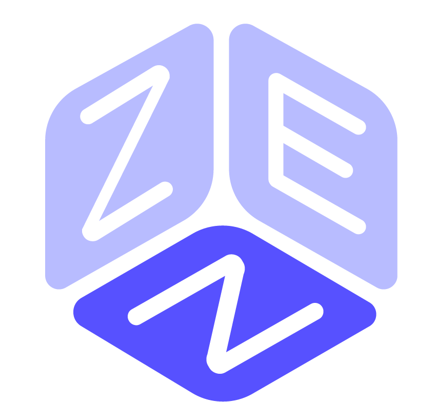

<h1 align="center">GameZen iOS</h1>

	

NOTE: this README is also available [in Italian](README.md).

NOTA: questo README è disponibile anche [in Italiano](README.md).

# Summary

- [Context](#context)
- [Repository structure](#repository-structure)
- [Installation](#installation)
- [License](#license)
	- [Authors/Copyright](#authors/copyright)
	- [Third-party components](#third-party-components)

# Context
This repository contains the source code of GameZen's iOS client, an app for purchasing board games from an online store. This project was created by the student Alessio Rubicini as an elaborate for the 2020/2021 State school Exam. The application was therefore created for educational purposes only.

# Repository structure

├── api:                 HTTP API for app-database interaction 
├── app:                 iOS app 
├── database:            Platform's database 
├── design:              App assets and design 
├── docs:                Documentation 
├── README_EN.md:        English file containing information about the repository 
└── README.md:           Italian file containing information about the repository

# Installation

Requirements:
- macOS 11.0 o superiore
- Xcode 12.0 o superiore

# License

## Authors/Copyright

Copyright 2021 (©) Alessio Rubicini.

Check the AUTHORS file for extended reference.

## Third-party components

| Name                                                        | License                   |
| ----------------------------------------------------------- | ------------------------- |
| [Alamofire](https://github.com/Alamofire/Alamofire)         | MIT                       |
| [SwiftUIX](https://github.com/SwiftUIX/SwiftUIX)			  | MIT                       |
| [SwiftUIComponents](https://github.com/alessiorubicini/SwiftUI-Components)                                    | MIT |
| [StatusAlert](https://github.com/LowKostKustomz/StatusAlert)			  | MIT                       |
| [Cocoapods](https://cocoapods.org/)                         | MIT                       |
| [Fastlane](https://fastlane.tools)                         | MIT                       |

