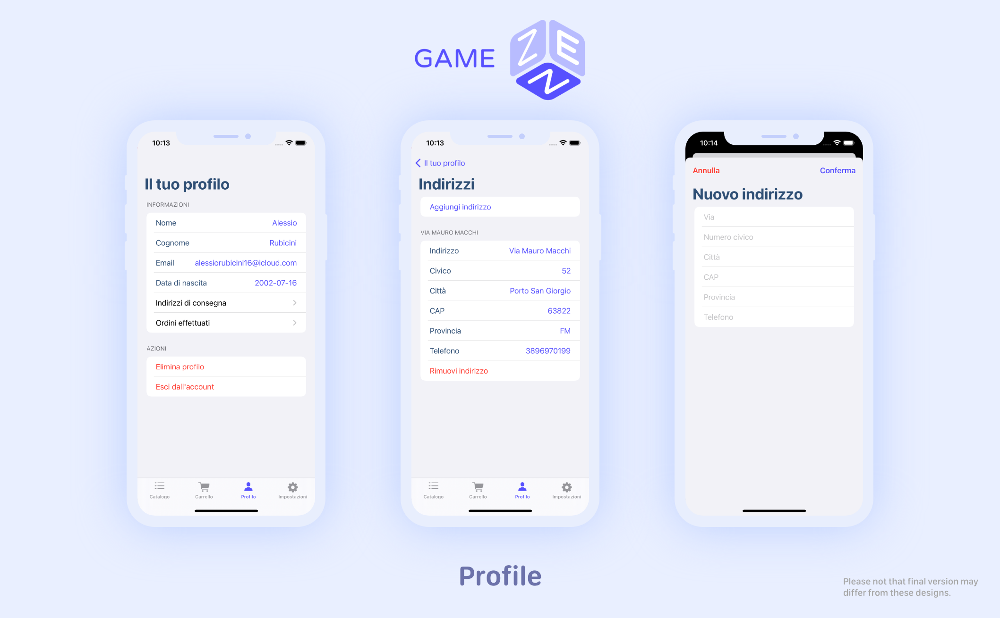

# GameZen's product

## Table of contents

- [Context](#context)
- [Onboarding & Authentication](#onboarding-&-authentication)
- [Catalog](#catalog)
- [Cart](#cart)
- [Profile](#profile)
- [Orders](#orders)
- [Settings](#settings)

## Context

This document describes the features and user flows made available by the GameZen iOS app.

Each section covers a specific part of the app. Features are described from the user’s point of view, using sentences in the first-person voice. When required, more details on _how_ the app delivers that particular feature are provided as sub-points. Note that this document does not attempt to define the specific details of the user experience or of the user interface. However, both are designed following the requirements laid out below.

In most of the cases, screenshots demonstrate how features are displayed on screen, based on the latest design of the app’s user interface.

## Onboarding & Authentication

I receive a brief explanation of why the app is useful and how it works.

I log into the app using my own account.
If I am not registered to the shop, I create a new account.

## Catalog
I consult the catalog through the complete products list, the specific categories or searching in the search bar.

## Cart

I add one or more product to my cart.
- The app asks the user to add a delivery address for the order, since the user can add multiple delivery addresses to its profile
- When the order is sent, the cart is emptied automatically

## Profile

I consult my profile's information. I can logout from my account or delete it.
I can eventually add or remove delivery addresses.

## Orders

I track my current orders and I can eventually cancel one.

## Settings

I manage my preferences, I read the F.A.Q. and I can share the app through other apps on my iPhone.

